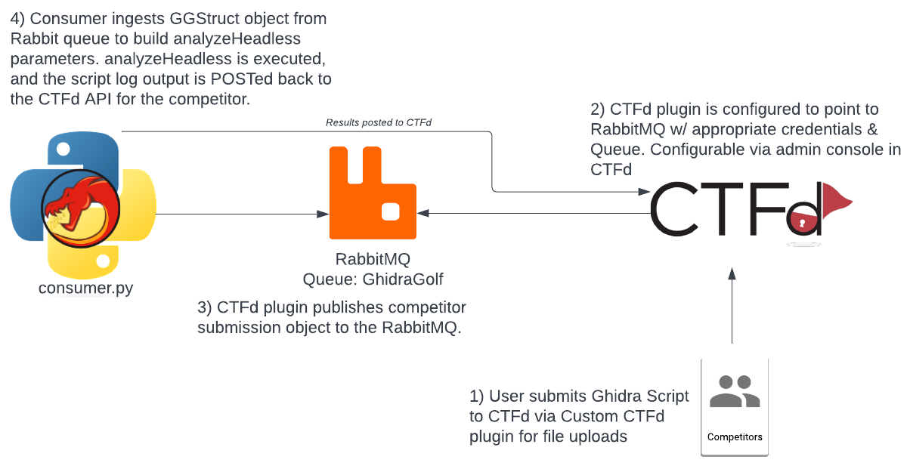

## About Ghidra Golf

Ghidra Golf is a reverse engineering/forensics Capture The Flag event with a focus on Ghidra Script development.
The contestant’s goal, in addition to solving traditional reverse engineering challenges, is to develop Ghidra Scripts to identify, parse, decrypt/decode or otherwise accomplish a specific reverse engineering task. Contestants are provided with a binary to download, reverse engineer and to test their code against, before submitting their Ghidra Script for evaluation.

## ctfd-ghidragolf

This repo contains a docker-compose file that deploys [CTFd](https://ctfd.io) with a Ghidra Golf configuration.
This includes custom CTFd plugin [ctfd-fileupload](https://github.com/ghidragolf/ctfd-fileupload),
along with RabbitMQ and [GG-Consumer](https://github.com/ghidragolf/gg-consumer) for Ghidra Script submission and execution.
The overall work flow of these services can be seen in the image below.




* For specific information related to the fileupload plugin, please see the [ctfd-fileupload](https://github.com/ghidragolf/ctfd-fileupload) repo.

* For specific information related to consumer.py, please see the [gg-consumer](https://github.com/ghidragolf/gg-consumer) repo.

* For entry level challenges to be used with Ghidra Golf as an instructional guide on beginning Ghidra Scripting, please see the [putting_green](https://github.com/ghidragolf/putting_green) repo.

## Building
Recursively clone this repo and submodules
```
$> git clone git@github.com:ghidragolf/ctfd-ghidragolf --recursive
```

```
$> docker-compose build . 
```

## Deploying
A bash script called ```setup.sh``` within this repository will setup the appropriate 
file structure that enables applications within the containers to run as non-root users.

The default configuration within docker-compose is made to provide an easy out of the box experience.
When deploying in production/competition environments, it is strongly advised to change these values.

```bash
$> ./setup.sh
```

To create the challenges for [putting green](https://github.com/ghidragolf/putting_green), execute ```./create_example_challenges.sh```
after updating the ```CTFD_API_TOKEN``` with your custom token.

*Note, at the time of publication the CTFd API does not contain an endpoint to upload binaries to specific challenges.
This must be done manually.*
